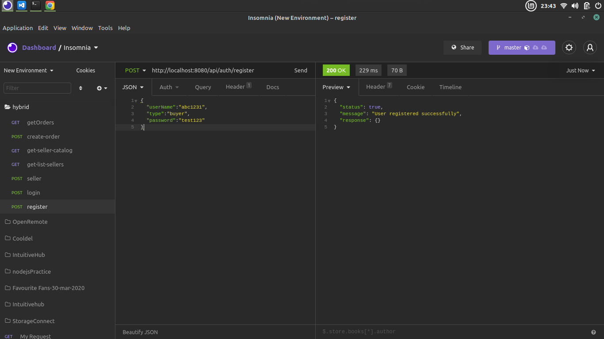
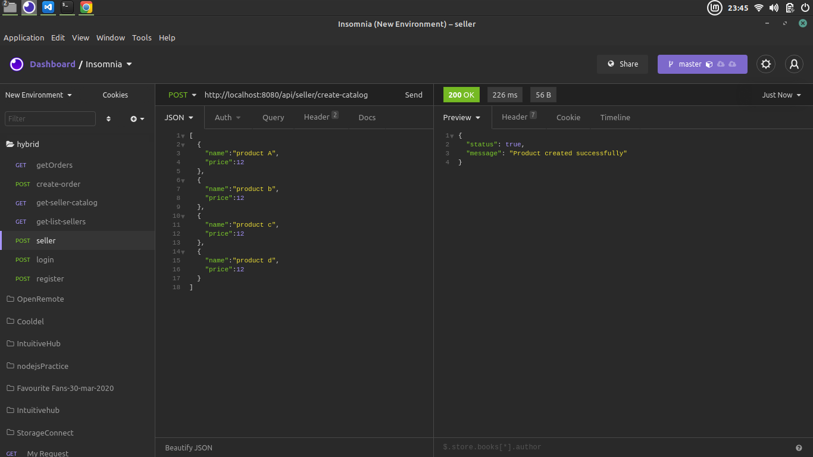
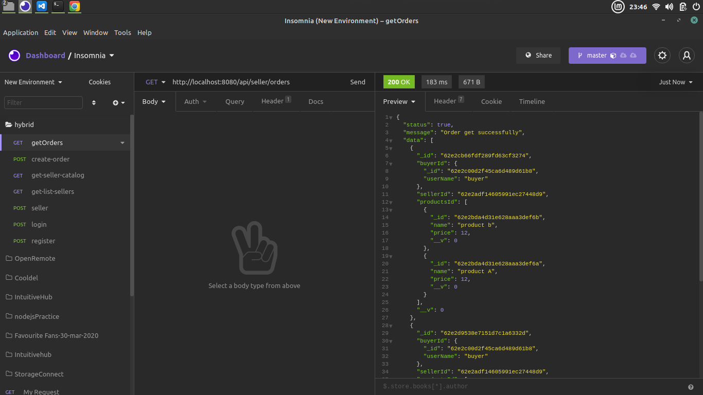
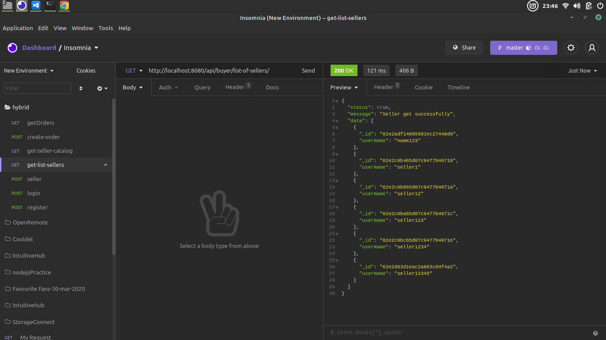
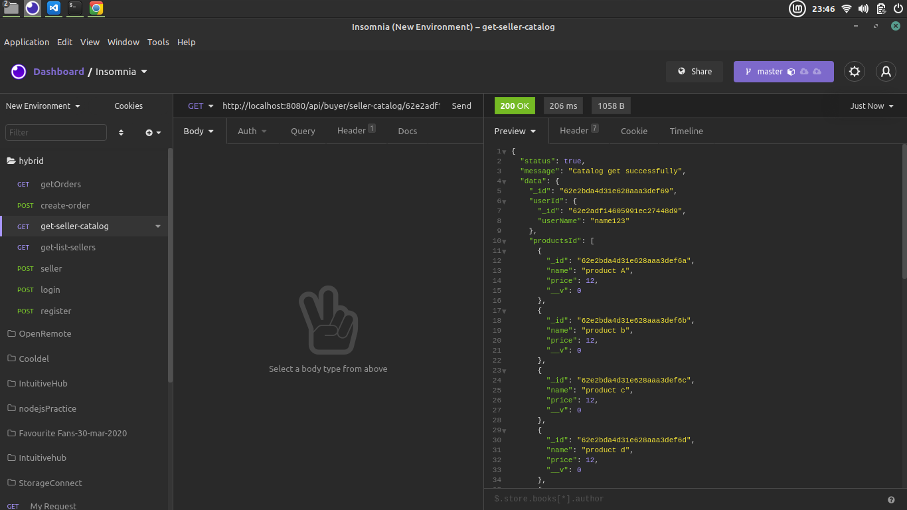
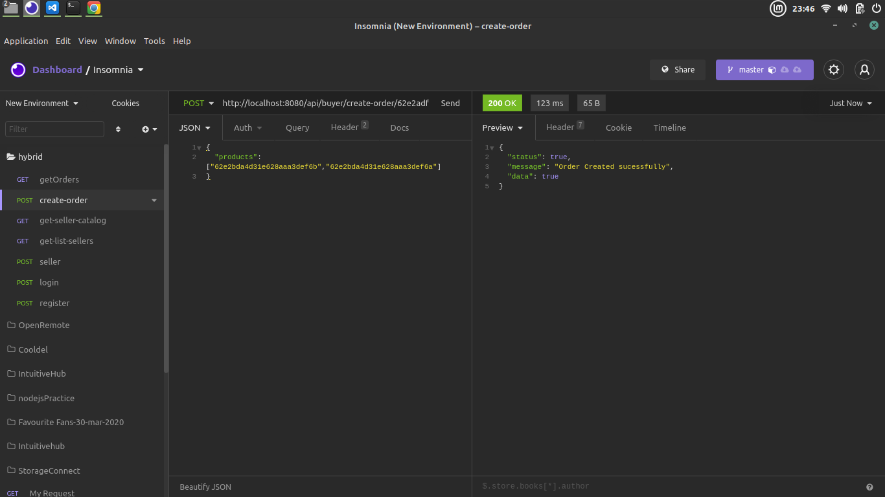

# hybr!d backend
Basic nodejs crud app, with buyer seller logic

## Prerequisites

- npm
- node

## Installing App

Steps:
- Clone the git repository [Hybrid test](https://github.com/staz6/hybrid-backend-test)
- cd into directory
- run `npm install`
- run `npm start`

## ScreenShots:
- Login

- Register

- Create Catalog

- Get Order

- Get Seller

- Get Seller Catalog

- Place order

